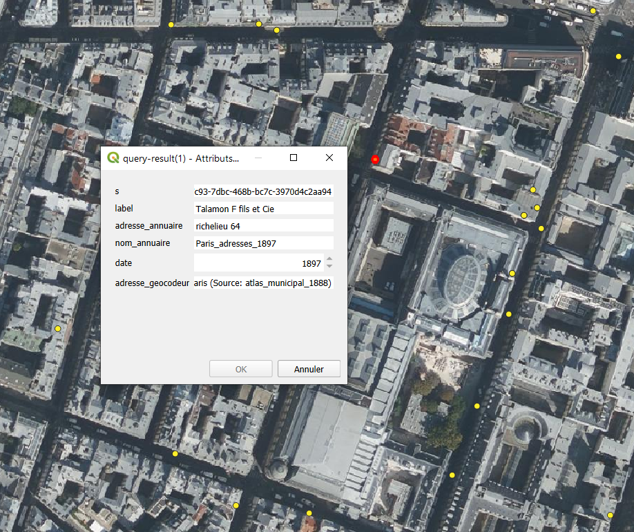

# Quelques requêtes pour exporter les données, sous diverses formes selon les usages

Les requêtes ci-dessous s'appliquent sur les données générées par le mapping r2rml directory.ttl.

## Sauvegarde d'un graphe complet

Sous GraphDB, aller dans Explorez / Aperçu des graphes puis choisir le format d'export dans Dépôt d'exportation (par exemple Turtle). Cliquer sur "Oui" si un avertissement au sujet du support des graphes apparait. Les données sont automatique exportées dans le dossier de téléchargement de votre navigateur. Elles pourront être rechargées à tout moment dans un nouveau dépôt GraphDB (ou dans un autre triplestore de votre choix), en allant dans le menu Importer / Télécharger des fichiers RDF.

## Export des entrées en CSV

Dans le menu SPARQL, exécuter la requête ci-dessous et demander à télécharger les résultats en CSV:
```sparql
PREFIX rdf: <http://www.w3.org/1999/02/22-rdf-syntax-ns#>
PREFIX rdfs: <http://www.w3.org/2000/01/rdf-schema#>
PREFIX ont: <http://rdf.geohistoricaldata.org/def/directory#>
PREFIX locn: <http://www.w3.org/ns/locn#>
PREFIX prov: <http://www.w3.org/ns/prov#>
PREFIX gsp: <http://www.opengis.net/ont/geosparql#>
PREFIX pav: <http://purl.org/pav/>
select distinct ?s ?label ?adresse_annuaire ?nom_annuaire ?date ?adresse_geocodeur ?coordonnees
where { 
GRAPH<http://rdf.geohistoricaldata.org/id/directories/nouveautes_test>
 {?s a ont:Entry.
  ?s rdfs:label ?label.
  ?s locn:address ?add.
  ?add prov:wasGeneratedBy <http://rdf.geohistoricaldata.org/id/directories/activity/0001>.
  ?add locn:fullAddress ?adresse_annuaire.
  ?s prov:wasDerivedFrom ?annuaire.
  ?annuaire rdfs:label ?nom_annuaire.
  ?annuaire pav:createdOn ?date.
  ?s locn:address ?add2.
  ?add2 prov:wasGeneratedBy <http://rdf.geohistoricaldata.org/id/directories/activity/0002>.
  ?add2 locn:fullAddress ?adresse_geocodeur.
  ?add2 gsp:hasGeometry/gsp:asWKT ?wkt
  BIND(STRAFTER(str(?wkt), '<http://www.opengis.net/def/crs/OGC/1.3/CRS84> ')AS ?coordonnees)
}
}order by ?label 
```

NB: Ces données peuvent être chargées sour QGIS pour produire une analyse spatiale ou une visualisation cartographique. Pour cela, aller dans "Couches/ Ajouter une couche / Ajouter une couche de texte délimité" et sélectionner le fichier CSV que vous avez exporté. L'attribut coordonnées contient la géométrie. Elle est de type Point, dans le système de coordonnées WGS84 (EPSG:4326).

## Export des entrées en CSV, pour les données géocodées dans une zone particulière (ex. ici, le quartier Richelieu)

Dans le menu SPARQL, exécuter la requête ci-dessous et demander à télécharger les résultats en CSV:
```sparql
PREFIX rdf: <http://www.w3.org/1999/02/22-rdf-syntax-ns#>
PREFIX rdfs: <http://www.w3.org/2000/01/rdf-schema#>
PREFIX ont: <http://rdf.geohistoricaldata.org/def/directory#>
PREFIX locn: <http://www.w3.org/ns/locn#>
PREFIX prov: <http://www.w3.org/ns/prov#>
PREFIX gsp: <http://www.opengis.net/ont/geosparql#>
PREFIX geof: <http://www.opengis.net/def/function/geosparql/>
PREFIX pav: <http://purl.org/pav/>
select distinct ?s ?label ?adresse_annuaire ?nom_annuaire ?date ?adresse_geocodeur ?coordonnees
where { 
GRAPH<http://rdf.geohistoricaldata.org/id/directories/nouveautes_test>
 {?s a ont:Entry.
  ?s rdfs:label ?label.
  ?s locn:address ?add.
  ?add prov:wasGeneratedBy <http://rdf.geohistoricaldata.org/id/directories/activity/0001>.
  ?add locn:fullAddress ?adresse_annuaire.
  ?s prov:wasDerivedFrom ?annuaire.
  ?annuaire rdfs:label ?nom_annuaire.
  ?annuaire pav:createdOn ?date.
  ?s locn:address ?add2.
  ?add2 prov:wasGeneratedBy <http://rdf.geohistoricaldata.org/id/directories/activity/0002>.
  ?add2 locn:fullAddress ?adresse_geocodeur.
  ?add2 gsp:hasGeometry/gsp:asWKT ?wkt
  BIND(STRAFTER(str(?wkt), '<http://www.opengis.net/def/crs/OGC/1.3/CRS84> ')AS ?coordonnees)
 FILTER (geof:sfIntersects(?wkt, "<http://www.opengis.net/def/crs/OGC/1.3/CRS84> Polygon((2.3351 48.8640, 2.3325 48.8700, 2.3328 48.8702, 2.3328 48.8707, 2.3400 48.8719, 2.3430 48.8715, 2.3409 48.8662, 2.3413 48.8661, 2.3418 48.8658, 2.3415 48.8654, 2.3407 48.8653, 2.3394 48.8629, 2.3351 48.8640))"^^gsp:wktLiteral))
}
}order by ?label 
```
NB: Ces données peuvent être chargées sour QGIS pour produire une analyse spatiale ou une visualisation cartographique. Pour cela, aller dans "Couches/ Ajouter une couche / Ajouter une couche de texte délimité" et sélectionner le fichier CSV que vous avez exporté. L'attribut coordonnées contient la géométrie. Elle est de type Point, dans le système de coordonnées WGS84 (EPSG:4326).



