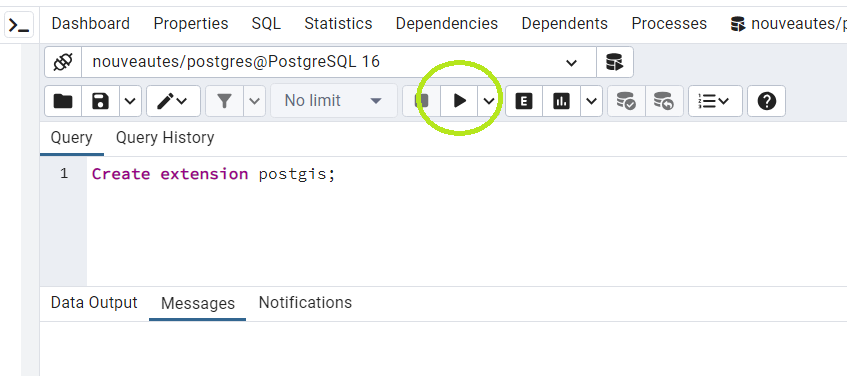

# Extraction des entrées d'annuaires relatives à un type d'activité, vers une base PostgreSQL locale

1) Lancez pgAdmin 4 et ouvrez un serveur local.

2) Créez une base PostgreSQL vide (clic droit / create database). Ouvrez votre base, et l'éditeur de requêtes (Tools / Query tool). Tapez la commande suivante dans l'éditeur de requêtes et exécutez-la en cliquant sur le bouton entouré en vert:



Cette extension permet à votre base de données de stocker des données géographiques, dotées de géométries sur lesquelles on peut faire des analyses spatiales quantitatives.

3) Ajoutez les schémas utiles et connectez-vous à la base *soduco* distante pour y lire et sélectionner les données. Pour cela, ouvrez le fichier *Create_local_schema_and_connect_to_server.sql* dans votre éditeur de requêtes et exécutez-le sans rien modifier.
4) Testez les mots-clés qui vous semblent pertinents pour récupérer les entrées relatives à un type d'activité donné et affinez-les avant de procéder à l'export des données proprement dit. Pour cela, ouvrez le fichier *Test_keywords.sql* dans l'éditeur de requêtes, modifiez les mots-clés selon les entrées que vous recherchez et excéutez le. Affinez vos mots-clés par essais/erreurs pour obtenir les données souhaitées. La partie à modifier est situé sous le commentaire encadré par des étoiles:

```sql
SELECT ...
WHERE (
/* ************************************************************* */
/* Modifier la liste des mots-clés selon les données à extraire  */
/* ************************************************************* */
		act.act ILIKE '%photo%' OR
		act.act ILIKE '%daguer%' OR
		act.act ILIKE '%opti%'
		)
```
Dans le fichier Test_keywords.sql on teste seulement trois mots-clés: photo, daguer et opti, précédés ou suivis de n'importe quelle chaîne de caractères. Des exemples plus élaborés sont proposés dans les fichiers *Create_local_tables.sql* et *Insert_into_local_tables.sql*. 

5) Créez votre base locale et importez-y les données correspondant aux mots-clés que vous avez préalablement identifiés comme valides. Pour cela, ouvrez le fichier *Create_local_tables.sql* dans l'éditeur de requêtes, modifiez les parties indiquées sous les commentaires encadrés par des étoiles, et exécutez le. Parmi les modifications à effectuer, il faut:
   * changer les mots-clés à deux endroits (mettre les mêmes à chaque fois!)
   * compléter les métadonnées du jeu de données:
     * son identifiant, "cartes_et_plans" dans le fichier exemple, à remplacer par un nom court correspondant à votre jeu de données;
     * son titre, "Graveurs et marchands de cartes et plans" dans le fichier exemple, à remplacer par un titre court correspondant à votre jeu de données;
     * sa date d'extraction, "2023-10-29" dans le fichier exemple, à remplacer par celle où vous crez votre jeu de données.

```sql
/* ****************************************************************************************************************************** */
/* Modifier les propriétés du graphe nommmé selon les données extraites: identifiant, titre du jeu de données, date d'extraction  */
/* ****************************************************************************************************************************** */
UPDATE directories_graph.directories_content SET graph_name ='cartes_et_plans';
UPDATE directories_graph.geocoding SET graph_name ='cartes_et_plans';
INSERT INTO directories_graph.dataset VALUES ('Graveurs et marchands de cartes et plans', '2023-10-29', 'cartes_et_plans', gen_random_uuid ());
```  

7) De façon optionnelle, si vous souhaitez travailler sur plusieurs jeux de données relatifs à différents types d'activités:
* testez de nouveaux mots clés comme à l'étape 4;
* insérez les données correspondantes dans votre base de données locale à l'aide du fichier *Insert_into_local_tables.sql*: ouvrez-le dans l'éditeur de requêtes, modifiez les parties indiquées sous les commentaires encadrés par des étoiles, et exécutez le.
